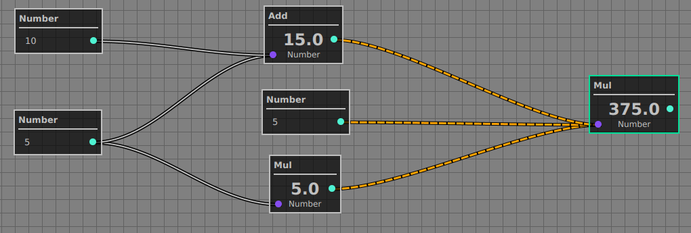
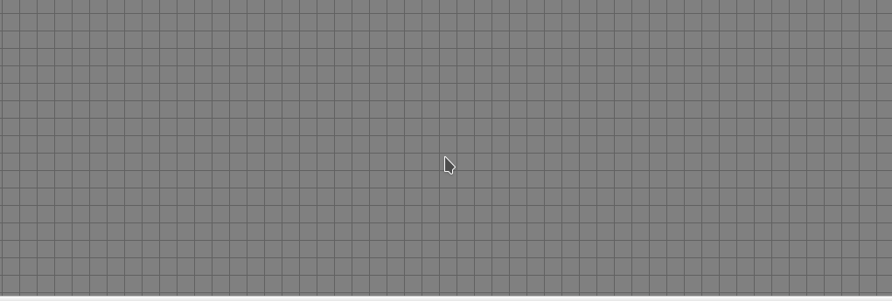

## Node Editor

#### Main Goal
Figure out how to use topological sort in real apps 
implementing customizable node editor that could be 
used as:
 - simple calculator
 - shader editor
 - data workflow

#### Tasks
 - [x] Develop architecture that can be used for 
 custom node construction (user can define what
 components the visual node should have and how
 it can process its value)
 - [x] Implement DFS as part of Topological sorting
 for proper node evaluation order
 - [x] Implement some fancy UI with user guides (animated 
 incoming connections, node selection, node connection, etc)
 - [ ] Implement infinite scrolling
 - [ ] Add more comments
 - [ ] Add input validation
 - [ ] Implement more default controls
 - [ ] TBD
 
 ## Examples
 TBD
 
 #### Screenshots
Implementation results:
 1. Simple calculator

## Afterword
It's only a pet project for trying different ideas. I'm open
for any suggestions/improvements and it's also free to use.
Any credits to me will be enough :D